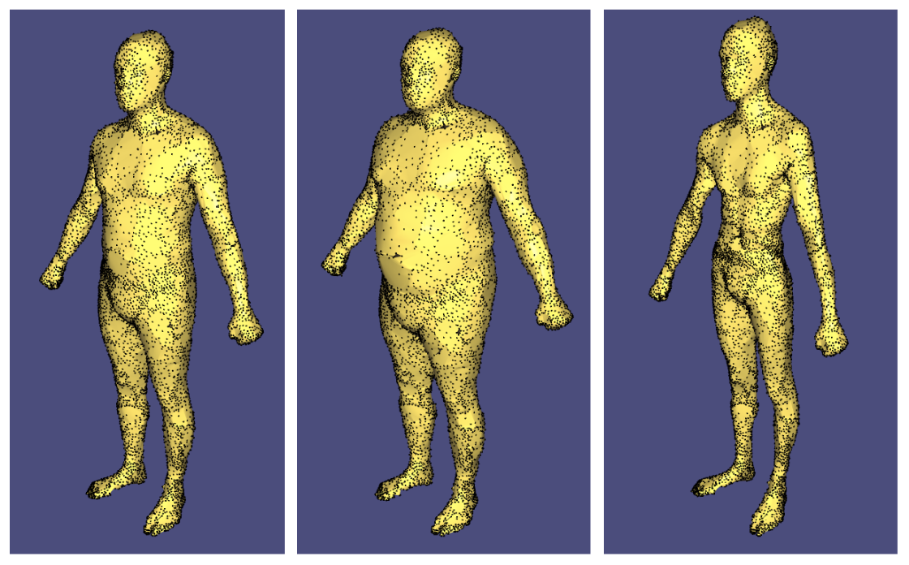

# PCA Based Body Model Parameterisation

This project generates a parameterisation of a set of full body models. This parameterisation is generated by calculating principle component analysis on all of the vertices of each model. With the PCA vectors having been calculated, it is then possible to adjust their weightings to generate new models with adjusted features. Each principle component encodes certain bodily features. Scaling the most important principle components for a given model will adjust the features with the greatest variance between models. These principle components tend to adjust features such as the body mass, height and posture of the model.

This enables the generation of an infinite amount of unique models, each based off of the features of the supplied input models.

This projects work was based on the paper: [The space of human body shapes](paper.pdf). It was a join collaboration between myself and [Fen Jin](https://www.linkedin.com/in/fen-jin/) for an MSc project.

A detailed examination of this project can be viewed in the report I wrote [here](report.pdf).
